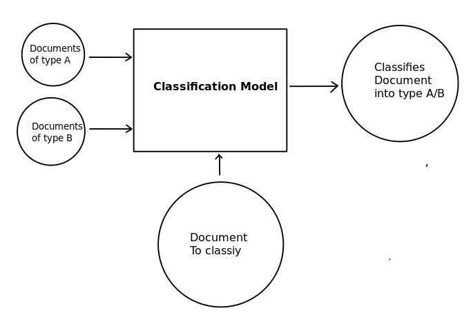
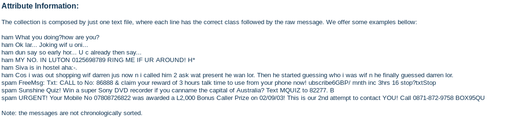

```{r setup, include=FALSE}
knitr::opts_chunk$set(echo = TRUE)
```

## Introduction

Document classification or Document categorization is to classify documents into one or more classes/categories manually or algorithmically. Today we try to classify classify new "test" documents using already classified "training" documents, using spam/ham dataset, then predict the class of new documents.



## The Classification Model:

We can divide the steps into:

- Creation of Corpus
- Preprocessing of Corpus 
- Creation of Term Document Matrix   
- Preparing Features & Labels for Model 
- Creating Train & test data 
- Running the model 
- Testing the model 

We implement the document classification using tm/plyr packages, as preliminary steps, we need to load the required libraries into R environment:


### Corpus creation and The Data for our SPAM model

Corpus is a large and structured set of texts used for analysis. We will use the dataset from the SMS Spam Collection to create a Spam Classifier. This can be downloaded from the [UCI Machine Learning Repository](https://archive.ics.uci.edu/ml/datasets/SMS+Spam+Collection).

This dataset includes the text of SMS messages along with a label indicating whether the message is unwanted. Junk messages are labeled spam, while legitimate messages are labeled ham.

The collection is composed by just one text file, where each line has the correct class followed by the raw message. We offer some examples bellow: 




```{r}
#Import libraries
library(tm)
library(SnowballC)
library(wordcloud)
library(RColorBrewer) 
library(e1071)         #For Naive Bayes
library(caret)         #For the Confusion Matrix
library(gmodels) #provides CrossTable() function for comparison

#Import data
RawSMS <- read.csv("data/SMSSpamCollection.csv", sep="\t", header=TRUE)
head(RawSMS)

```


```{r}
#Select & rename appropriate columns of the dataset
RawSMS <- RawSMS[, 1:2]
colnames(RawSMS) <- c("Tag", "Msg")
str(RawSMS)

```


```{r}
RawSMS$Tag <- factor(RawSMS$Tag)

# creating our corpus
text_corpus <- VCorpus(VectorSource(RawSMS$Msg))

# Viewing the content of more than one texts using lapply() function
lapply(text_corpus[1:5], as.character) 
```

### Cleaning our Corpus

```{r}
cleanCorpus <- tm_map(text_corpus, content_transformer(tolower)) # lowercase all texts
cleanCorpus <- tm_map(cleanCorpus, removeNumbers) # remove all numbers
cleanCorpus <- tm_map(cleanCorpus, removeWords, stopwords('english')) # remove all common words such as to, but and etc.
cleanCorpus <- tm_map(cleanCorpus, removePunctuation) # remove all punctuation
cleanCorpus <- tm_map(cleanCorpus, stripWhitespace) # remove all whitespace


text_dtm <- DocumentTermMatrix(cleanCorpus)
inspect(text_dtm)
```

### Creating Train & test data

As the dataset is a randomnly sorted, we can directly divide the data into the training and test dataset. Let’s take a proportion of 75:25 for the training:test data.

```{r}
# Creating train and test portions 
train <- text_dtm[1:2387, ] # 75% for training
test <- text_dtm[2387:3183, ] # 25% for testing
train_type <- RawSMS[1:2387, ]$Tag
test_type <- RawSMS[2387:3183, ]$Tag
```

```{r}
#training portion
tbl_train <- prop.table(table(train_type))
tbl_train
```

Using the prop.table()function we can validate that the data in the training & test sets are both split into 85% ham & 15% spam messages.
```{r}
#testing portion
tbl_test <- prop.table(table(test_type))
tbl_test
```

### Build the spam cloud

Wordclouds are simple yet effective for text visualization, so let’s visualize the spam/ham messages using some wordclouds.

A word cloud depicts the frequency of words appearing in the text. The larger the size of the word, the greater the frequency.

```{r}
spamText <- subset(RawSMS, Tag == "spam") 
wordcloud(spamText$Msg, max.words = 50, scale = c(5, 0.3),random.order = FALSE, rot.per = 0.15, colors = brewer.pal(8, "Dark2") )

```
```{r}

hamText <- subset(RawSMS, Tag =="ham") # selecting ham texts
wordcloud(hamText$Msg, max.words = 50, scale = c(5, 0.3),random.order = FALSE, rot.per = 0.15, colors = brewer.pal(8, "Dark2"))
```
### Creating Indicator Features

We are going to transform the sparse matrix into something the Naive Bayes model can train. We will extract the most frequent words in the texts using using findFreqTerms()

```{r}
freq_words <- findFreqTerms(train, 5) 
str(freq_words)
```

Converting numerical vectors of the DTM to categorical vector for the model

```{r}
# Selecting only the frequent words from the train and test datasets
freq_words_train <- train[ , freq_words]
freq_words_test <- test[ , freq_words]


# creating a function for conversion
convert <- function(x) {x <- ifelse(x > 0, "y", "n")} 
train <- apply(freq_words_train, MARGIN = 2, convert)
test <- apply(freq_words_test, MARGIN = 2, convert)
str(train) # verifying the conversion
```

### Training our Model

We will use naiveBayes() function from the e1071 package to train our classifier. The algorithm uses the presence or absence of words to assess the probability that a given SMS message is spam.

```{r}
# Creating a Naive Bayes classifier
sms_classifier <- naiveBayes(train, train_type)

# Making prediction & evaluation with the classifier
test_prediction <- predict(sms_classifier, test)

CrossTable(test_prediction, test_type, 
           prop.chisq = FALSE, prop.t = FALSE,
           dnn = c('predicted', 'actual'))
```

This Classifier gives us a higher accuracy.

let’s improve the model by tweaking one of the parameters of the NaiveBayes classifier, that is laplace parameter, and see what’s going to happen.
```{r}
#laplace assures that one word is not mislabled just because it appeared once on ham/spam texts
sms_classifier_improved <- naiveBayes(train, train_type, laplace = 1)
test_prediction_improved <- predict(sms_classifier_improved, test)

CrossTable(test_prediction_improved, test_type, 
           prop.chisq = FALSE, prop.t = FALSE,
           dnn = c('predicted', 'actual'))
```
As we can see, only 24 messages are now mislabeled.

